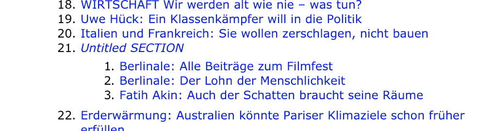
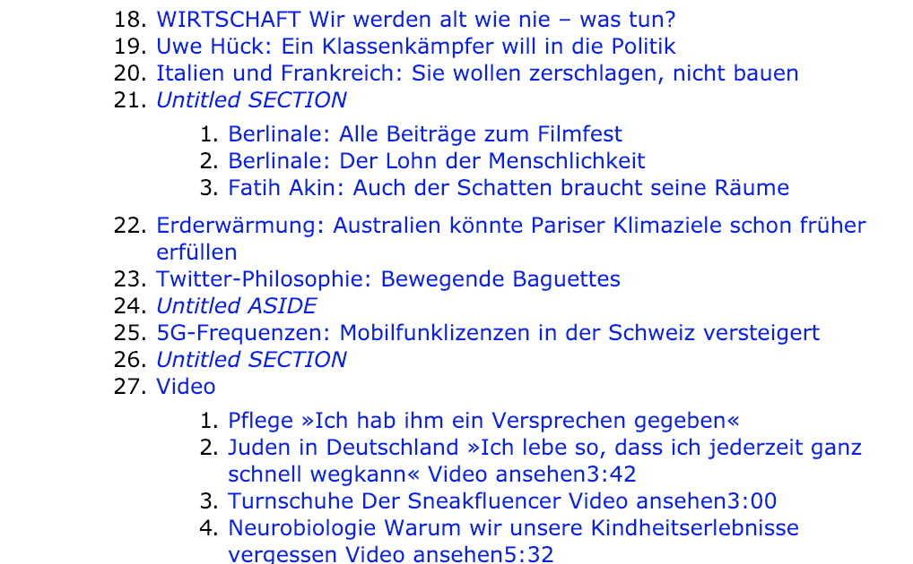

# Small Wins: Improving our Document Outline

The document outline is 

["das Inhaltsverzeichnis ist ein Verzeichnis des Inhalts !??"]


## what is an document outline?

The document outline represents the logical or semantical structure of an HTML document. This is a little difficult, because there are two concepts: hierarchy of headlines `h1` to `h6` and the nested structure of `sections` and `divs`. 

That whole topic is a [big dilemma](https://css-tricks.com/document-outline-dilemma/), but nevertheless we can try to improve our sites 

That's what we did recently with our homepage on [www.zeit.de](https://www.zeit.de/index).


## how the document outline was before

How can we even see the outline, without actually using a screen reader?

There are ways to make the document outline visible. The easiest one is a chrome browser extension "[HTML Outliner](https://chrome.google.com/webstore/detail/html5-outliner/afoibpobokebhgfnknfndkgemglggomo)". It simply renders the document outline of a web site. Because it runs in the browser, we could also use it on localhost during development.

The same tool is also available as [Bookmarklet](https://h5o.github.io/bookmarklet.html).

Another great tool is the [Nu Html Checker from the W3C](https://validator.w3.org/nu/), which checks online URLs, but also accepts text input, which enabled us to test local versions of our site during development. 

The HTML Checker provides [two kinds of outline](https://validator.w3.org/nu/?showoutline=yes&doc=https%3A%2F%2Fwww.zeit.de%2Findex), which perfectly illustrates the dilemma mentioned above: 


READ: http://html5doctor.com/computer-says-no-to-html5-document-outline/
READ: https://medium.com/@Heydon/managing-heading-levels-in-design-systems-18be9a746fa3


## how we improved

### 1) Use correct container tags


```<div>
    <h2>Meistgelesene Artikel</h2>
    <ol>
      <li><article><h3>Teaser 1</h3></article></li>
      <li><article><h3>Teaser 2</h3></article></li>
      <li><article><h3>Teaser 3</h3></article></li>
    </ol>
</div>
```


```<section>
  <h2>Meistgelesene Artikel</h2>
  <ol>
    <li><article><h3>Teaser 1</h3></article></li>
    <li><article><h3>Teaser 2</h3></article></li>
    <li><article><h3>Teaser 3</h3></article></li>
  </ol>
</section>
```


By using a `section` instead of a `div` we opened a new outline scope/nesting and made clear that the headline type actually represents a hierarchy. (TODO: ist das wirklich die richtige Erklärung?)


In another case, we changed the container tag the other way around: from `section` to `div`. A teaser box which was defined as `section` also had a `section` as wrapper, which resulted from our CMS structure and the way centerpages are built. These two nested sections were reflected in the document outline, with one superficial level:


```<div>
    <section>
      <section> <!-- this was changed to div -->
        <article><h3>Teaser 1</h3></article>
        <div>
          <article><h3>Teaser 2</h3></article>
          <article><h3>Teaser 3</h3></article>
        </div>
    </section> <!-- this was changed to div -->
  </section>
</div>
```

By changing one container from `section` to `div`, we could flatten the outline hierarchy. 



You will notice that the section is still untitled. This is because the included teasers are of the same hierarchy, and there is no element which can be used as title.

While the flattening surely made the outline a bit better, there is still [room for improvement](TODO:Link_zu_dem_Abschnitt).


### 2) Promote relevant text nodes

By assigning headline status to text nodes which do not look like headlines (in our case descriptions of products in our shop, these nodes get respected as the elements title in the document outline.


before:
```<p class="shopitem__text">{{ teaser.teaserText }}</p>```


after:
```<h3 class="shopitem__text">{{ teaser.teaserText }}</h3>```


By the way, these changes are easily done because we use BEM as our CSS system. (TODO:LINK) 


## how we can improve more


* We still have untitled sections 


* Some things should be hidden from the outline (or even the DOM) 


## Resources

### Articles

- https://css-tricks.com/document-outline-dilemma/

### Tools

- Chrome Extension: [HTML Outliner](https://chrome.google.com/webstore/detail/html5-outliner/afoibpobokebhgfnknfndkgemglggomo)


__Written 2019-02-09 by [Thomas Puppe](TODO:Authorpage)__
