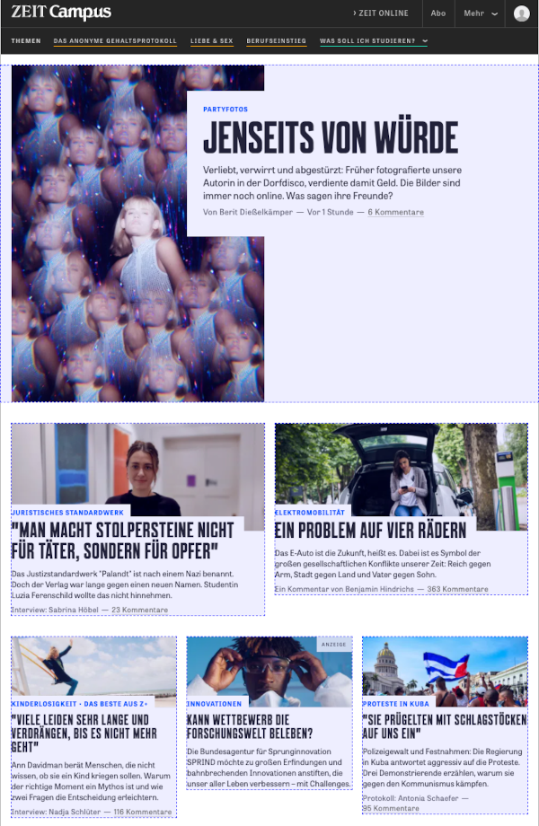

# Wie Links valide wurden und CSS-Grid einzog

Eines Tages stellten wir fest, dass die Linkstruktur unserer Teaser auf den Übersichtsseiten invalide war. Schuld daran waren verschachtelte Links, die wir bis dahin mit Hilfe des [&lt;object&gt;-Hack](https://www.kizu.ru/nested-links/) problemlos im Griff hatten. Leider verlor dieser Hack irgendwann seine Wirkung, und wir waren gezwungen zu handeln.<br/>
Inspiriert von Sara Soueidan's Artikel [Nested Links](https://www.sarasoueidan.com/blog/nested-links/) wurden unsere Teaser-Links wieder valide. Die Idee dahinter ist, die Links absolut, über die gesamte Teaserbreite und -höhe, als sogenannte *Layered-Links*, auf den Teasern zu positionieren. Damit war unsere Link-Struktur wieder valide, allerdings trat ein neuer unschöner Effekt auf: Die meisten Teaser-Linkflächen stießen jetzt nahtlos aneinander, was daran lag, dass die Teaser-Abstände mit einem Padding in den Teasern gestyled wurden. 

Zeit-Campus-Homepage mit nahtlos aneinander stoßenden Teaser-Linkflächen:


Auch wenn die Flächen nicht sichtbar waren, aus User-Perspektive wirkte das störend und sollte korrigiert werden. Ziel sollte es sein, dass die Linkflächen nur soviel Platz einnehmen, wie die Teaserinhalte. Im Zuge dieser Arbeiten wurde das vorhandene Teaser-Raster (auf Basis von `float`) durch ein Neues mit CSS-Grid ersetzt.

Gründe, die für CSS-Grid sprachen:
- breiter Browser-Support, [caniuse.com](https://caniuse.com/?search=grid)
- mit Flexbox gibt es einen guten Fallback für ältere Browser
- das Teaser-CSS wird einfacher und schlanker

## Vorgehensweise

### Das Teaser-Grid

Das Teaser-Raster auf den Übersichtsseiten ist einfach: Auf großen Screens (Desktop) wird es maximal dreispaltig, auf kleinen Screens (Mobil) brechen alle Teaser in eine Spalte um. 

```
/* single teaser column */
<div class="cp-region">
  <div class="cp-area">
    <div class="teaser"></div>
  </div>
</div>

/* 2 teaser columns */
<div class="cp-region cp-region--duo">
  <div class="cp-area cp-area--duo">
    <div class="teaser"></div>
  </div>
  <div class="cp-area cp-area--duo">
    <div class="teaser"></div>
  </div>
</div>

/* 3 teaser columns */
<div class="cp-region cp-region--trio">
  <div class="cp-area cp-area--trio">
    <div class="teaser"></div>
  </div>
  <div class="cp-area cp-area--trio">
    <div class="teaser"></div>
  </div>
  <div class="cp-area cp-area--trio">
    <div class="teaser"></div>
  </div>
</div>
```

Das folgende CSS zeigt das Styling für zwei- und dreispaltige Teaser. Die Grid-Styles werden mit Hilfe eines Mixins inkludiert, das wahlweise für eine vertikale oder horizontale Ausprägung sorgt. 

```
/* Mobil, alle Teaser untereinander */
.cp-region--duo,
.cp-region--trio {
  @include teaser-grid('vertical')
}


/* Desktop, 2-spaltig und 3-spaltig */
.cp-region--duo {
  @include teaser-grid('horizontal', 2)
}
.cp-region--trio {
  @include teaser-grid('horizontal', 3)
}
```

Die Teaserabstände, die Teil des CSS in den Teasern waren, sind mit `grid-column-gap` und `grid-row-gap` in die neuen Teaser-Grids umgezogen. 

Das Mixin für das Grid-Styling:

```
/* Sass Mixin */
@mixin teaser-grid($direction: 'vertical', $columns: 1) {
  display: grid;
  grid-auto-flow: row;

  @if $direction == 'vertical' {
    grid-row-gap: $vertical-space;
    grid-template-columns: minmax(0, 1fr);
  } @else if $direction == 'horizontal' {
    grid-column-gap: $gutter;
    grid-template-columns: repeat($columns, minmax(0, 1fr));
  }
}
```

Für ältere Browser wurde ein Fallback entwickelt, der Teil des Mixins ist. Sollte er irgendwann nicht mehr nötig sein, kann er hier für alle Teaser gelöscht werden. 

```
  // fallback with flexbox

  display: flex;
  flex-wrap: wrap;
  @if $columns > 1 {
    margin-left: -$cp-padding;
    margin-right: -$cp-padding;
  }

  & > * {
    @if $columns > 1 {
      width: div(100%, $columns);
      flex: 1 1 auto;
      padding-left: $cp-padding;
      padding-right: $cp-padding;
    }
    @else {
      width: 100%;
    }
    margin-bottom: $vertical-space--small;
  }
```

Das komplette Mixin für die Desktopansicht:

```
@mixin zco-teaser-grid($direction: 'vertical', $columns: 1) {
  
  // fallback with flexbox
  display: flex;
  flex-wrap: wrap;
  @if $columns > 1 {
    margin-left: -$cp-padding;
    margin-right: -$cp-padding;
  }

  // set grid and reset fallback styles, if grid is supported
  @supports (display: grid) {
    display: grid;
    flex-wrap: initial;
    grid-auto-flow: row;
    
    margin-left: 0;
    margin-right: 0;

    @if $direction == 'vertical' {
      grid-row-gap: $vertical-space;
      grid-template-columns: minmax(0, 1fr);
    } @else if $direction == 'horizontal' {
      grid-column-gap: $gutter;
      grid-template-columns: repeat($columns, minmax(0, 1fr));
    }
  }

  // flexbox fallback for child elements
  & > * {
    @if $columns > 1 {
      width: div(100%, $columns);
      flex: 1 1 auto;
      padding-left: $cp-padding;
      padding-right: $cp-padding;
    }
    @else {
      width: 100%;
    }
    margin-bottom: $vertical-space;

    // reset fallback styles, if grid is supported
    @supports (display: grid) {
      flex: initial;
      margin-bottom: 0;
      padding-left: 0;
      padding-right: 0;
      width: auto;
    }
  }
}
```

Die `@supports`-Regel wird von allen modernen Browser unterstützt. Browser, die `@supports` nicht unterstützen, ignorieren alles innerhalb der geschweiften Klammern. Deshalb defnieren wir zuerst die Fallbackstyles und anschließend die Grid-Styles. 

### Vertikale Abstände

Die Teaser-Grids waren fertig, aber es fehlten noch die äußeren Abstände, die zwischen Einzelteasern und Teaser-Gruppen. Mit dem folgenden Mixin wurde schließlich auch das erledigt: 

```
/* Einzel-Teaser, Teaser-Gruppe (Grid-Container) */
.cp-region {
    @include vertical-margin()
}

@mixin vertical-margin() {
  margin-bottom: $vertical-space--small;
  margin-top: $vertical-space--small;
  @media only screen and (min-width: $bp-desktop) {
    margin-bottom: $vertical-space;
    margin-top: $vertical-space;
  }
}
```

Bei einigen Teaserausprägungen waren abweichende Abstände gewünscht, für diesen Fall wurden die Teaser-Container mit entsprechenden Modifiern ausgezeichnet.

## Ergebnis

Zeit-Campus-Homepage jetzt: 



Die Vorteile nach Abschluss der Arbeiten:
- schlanke Teaser mit kompakten Klickflächen
- horizontale und vertikale Teaser-Abstände sind nicht mehr Teil des Teaser-CSS. Sie wandern hoch in die Teasergruppen, wo sie an einem Ort beschrieben sind. 
- die Teaser-Grids verwenden mit Grid ein modernes CSS-Feature, welches die `float`-Methode abgelöst hat

*geschrieben 2021.08.02, Daniel Kreitschmann*
