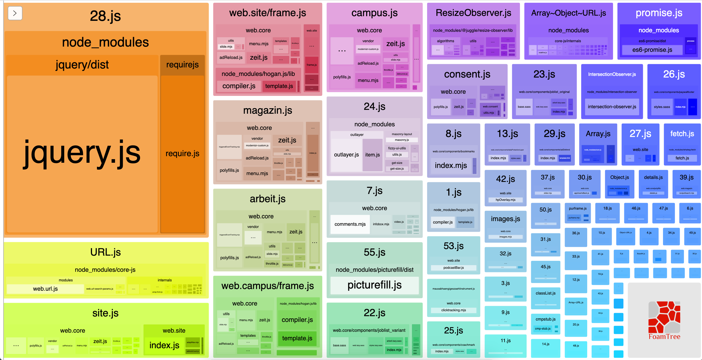
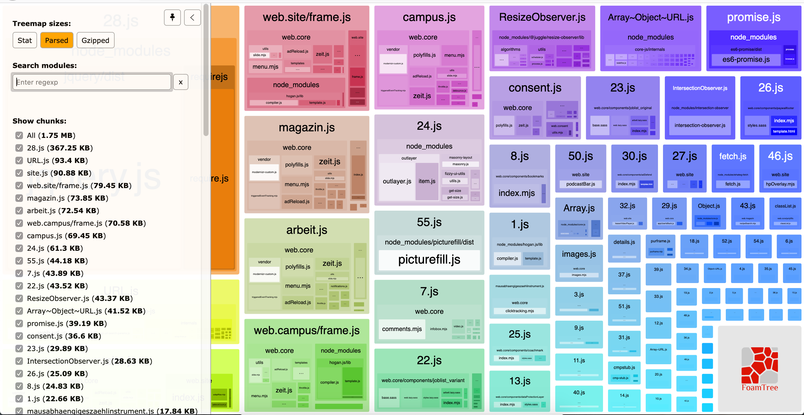
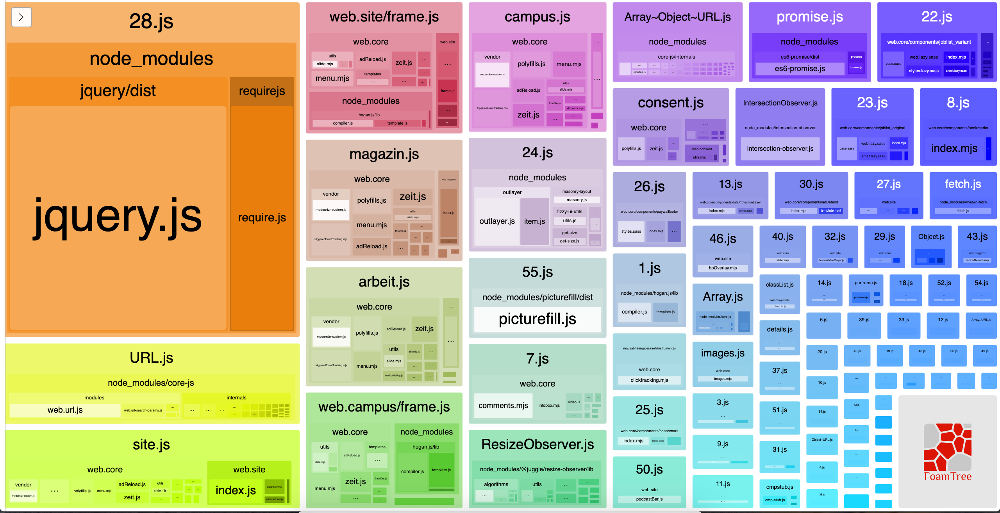
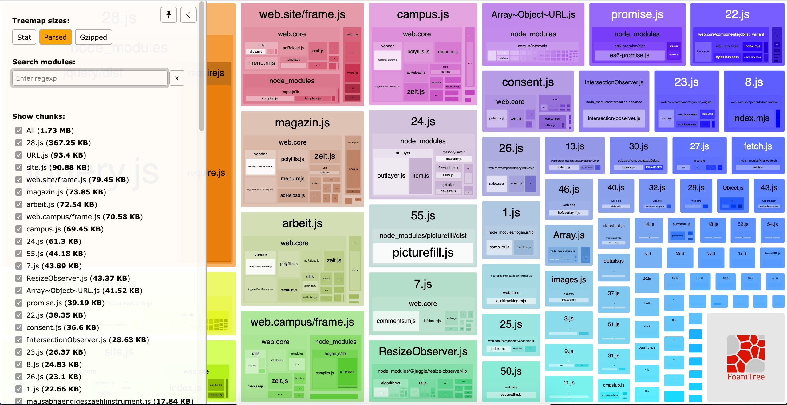
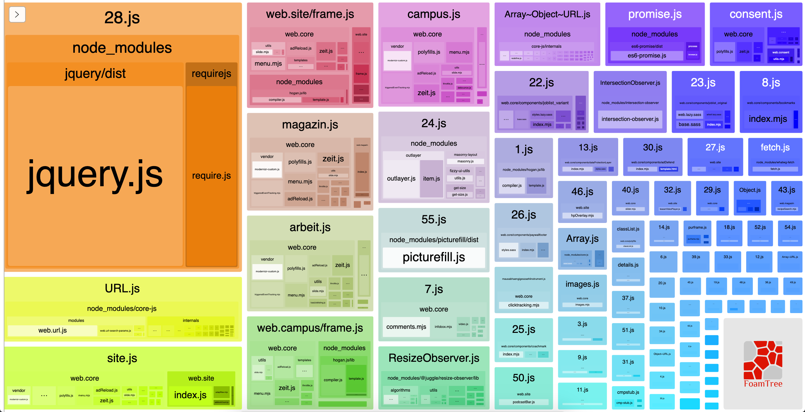
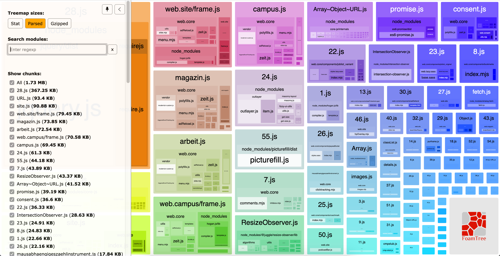

# Babel and our supported browserlist

From time to time we try to update our browserlist. We do this, because the used browsers change, and we want to decrease our js/ css size.

First of all we can now safely use babel on all our js files.

## currently
- `static/`
    - 6.3 MB on the disk / 525 files
- `static/css/`
    - 3.5MB on the disk / 355 files
- `static/js`
    - 860KB on the disk / 92 files
    - site.js: 33KB on the disk

## with babel applied to all files (`.m?js`)
- `static/`
    - 6.3 MB on the disk / 525 files
- `static/css/`
    - 3.5MB on the disk / 355 files
- `static/js/`
    - 860 KB on the disk / 92 files
    - site.js: 33KB on the disk

## with babel applied to all files (`.m?js`) and our browserlist updated
We might try to update our browserlist to reduce the bundle size.
Therefore we use [all Browsers with more then `0.3%` of usage in germany](https://browserl.ist/?q=%3E+0.3%25+in+DE). 
This results in a slight decrease of the file sizes.
- `static`
    - 6.2 MB on the disk / 525 files
- `css`
    - 3.4 MB on the disk / 355 files
- `js`
    - 848KB on the disk / 92 files
    - site.js: 33KB on the disk

## With babel applied to all files and a custom browserlist
    "browserslist": [
      "Chrome >= 55",
      "Firefox >= 52",
      "Edge >= 17",
      "Explorer >= 11",
      "iOS >= 9",
      "Safari >= 9",
      "Android >= 7",
      "Opera >= 58"
    ]
- `static/`
    - 6.1 MB on the disk / 525 files
- `static/css`
    - 3.3 MB on the disk / 355 files
- `static/js`
    - 848 KB on the disk / 92 files
    - site.js: 33 KB on the disk 

